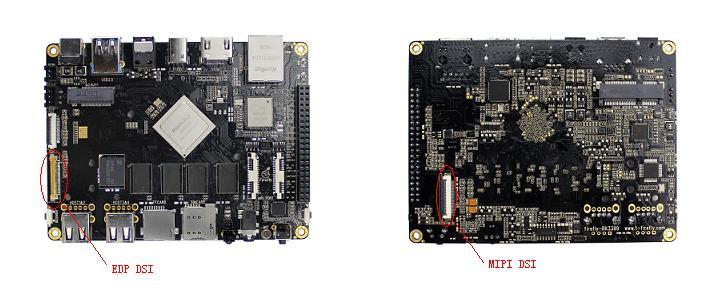
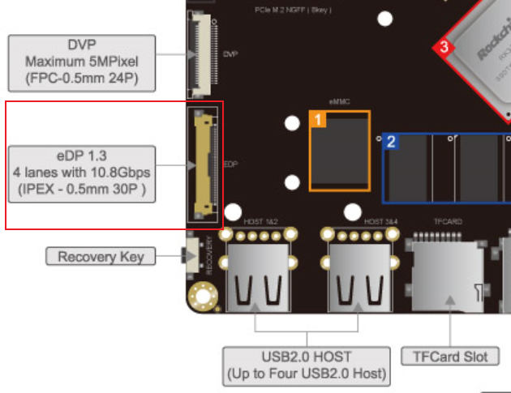
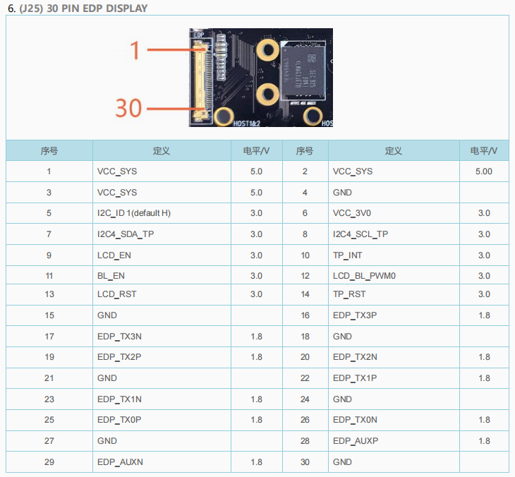
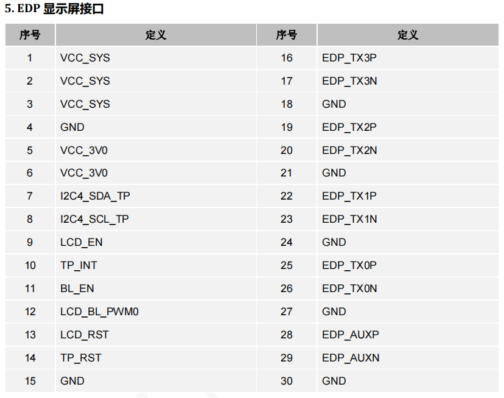
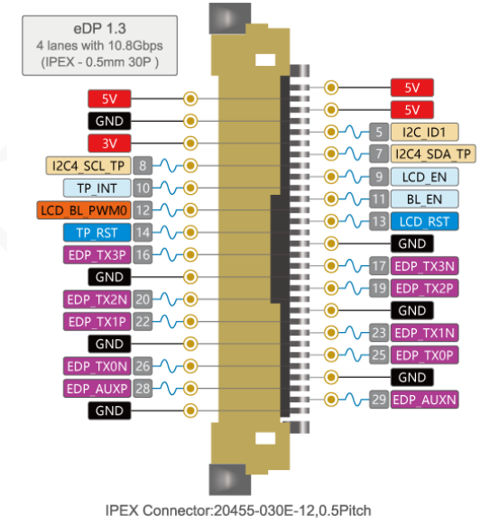
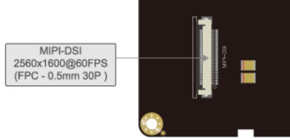
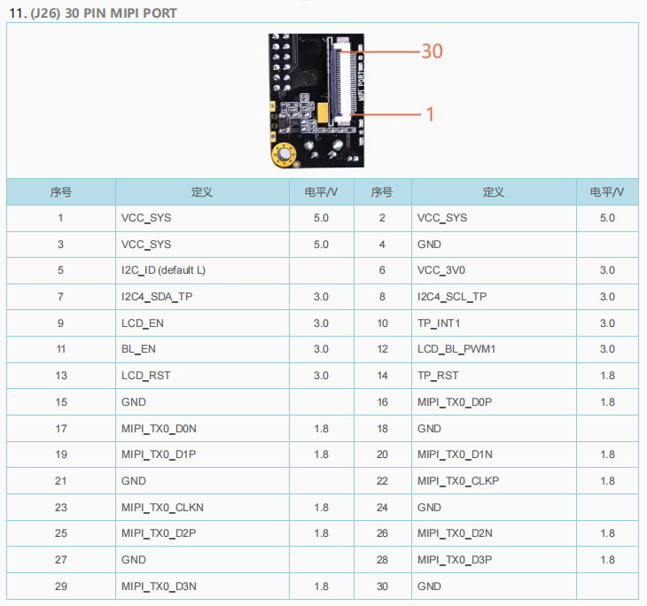
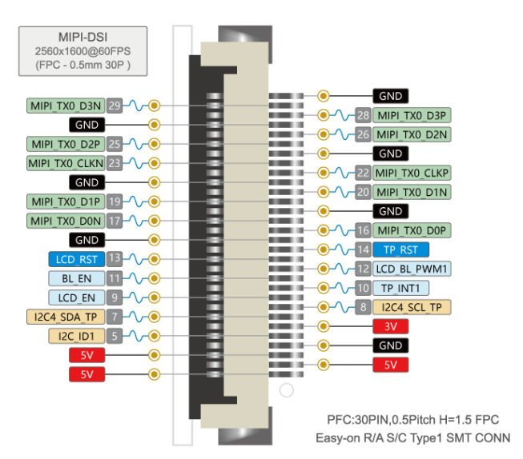

# LCD(Liquid Crystal Display)

* <https://wiki.t-firefly.com/zh_CN/Firefly-RK3399/driver_lcd.html#>

Firefly-RK3399 开发板外置了两个 LCD 屏接口，一个是 EDP，一个是 MIPI，接口对应板子上的位置如下图：

## edp

* IPEX连接器由来：1994年2月10日，I-PEX有限公司在东京町田成立，是一家无生产线连接器供应商。I-PEX设计并销售他们的连接器，外包制造给第一精工。
* edp只是协议，但是一般用的IPEX连接器
* eDP(Embedded DisplayPort)是数字显示技术领域的标准协议，其创始者为视频电子标准协会（VESA），创始成员包括戴尔、惠普、三星、飞利浦以及英伟达等。eDP协议是针对DP（Display Port）应用在嵌入式方向架构和协议的拓展，所以eDP协议完全兼容DP协议。相对于DVI/HDMI来说，eDP具有高带宽、整合性好、相关产品设计简单，该接口已广泛应用于笔记本电脑、平板电脑、手机等其它集成显示面板和图像处理器的领域。

引脚定义（引脚定义参看reference/Firefly-RK3399产品规格书.pdf）：

## mipi

* mipi只是协议，连接器一般用mipi
* FPC连接器 + FPC排线，FPC排线就是可在一定程度内弯曲的连接线组

柔性电路板（Flexible Printed Circuit 简称FPC）是以聚酰亚胺或聚酯薄膜为基材制成的一种具有高度可靠性，绝佳的可挠性印刷电路板。具有配线密度高、重量轻、厚度薄、弯折性好的特点。

FPC连接器，接触3mm的印刷电路板的安装高度，下，翻转锁（一触式旋转系统），防止脱落和FPC的斜交配，弹性针设计，可在零中频和非ZIF，可在0.3，0.5，1.0， 和1.25mm的中线现有锡铅或无铅表面贴装，四洞，垂直和直角可用的栈顶或底部接触

引脚定义（引脚定义参看reference/Firefly-RK3399产品规格书.pdf）：

---
