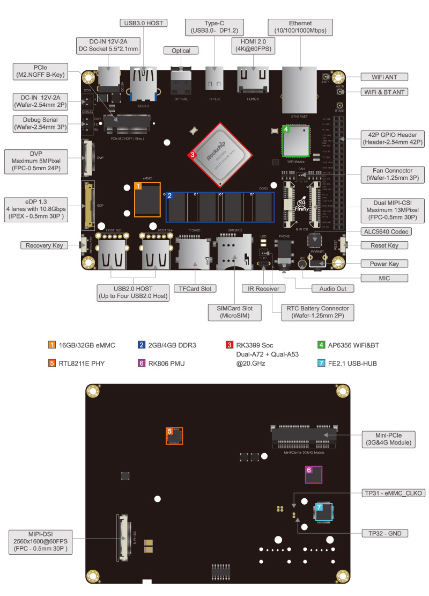

# 开发板接口

Firefly-RK3399 提供了丰富的接口，主要包括：

* 电源接口
* USB3.0 HOST
* 数字光纤
* Type-C
* HDMI
* 以太网
* WIFI 天线
* 蓝牙天线
* 双 MIPI 摄像头
* 风扇接口
* 复位按键
* 电源按键
* 硅麦
* 音频输入输出
* RTC 电源接口
* 红外接收
* TF 卡槽
* USB2.0 HOST
* recovery 按键
* DVP 摄像头接口
* 调试串口
* PCIE 接口
* 电池电源输入口
* MINI-PCIE
* EDP 屏接口
* MIPI 屏接口

 

---
